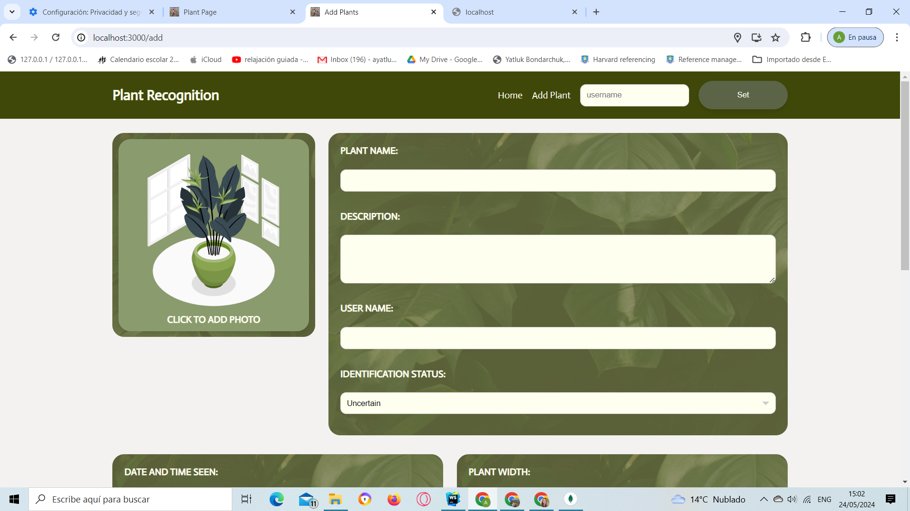
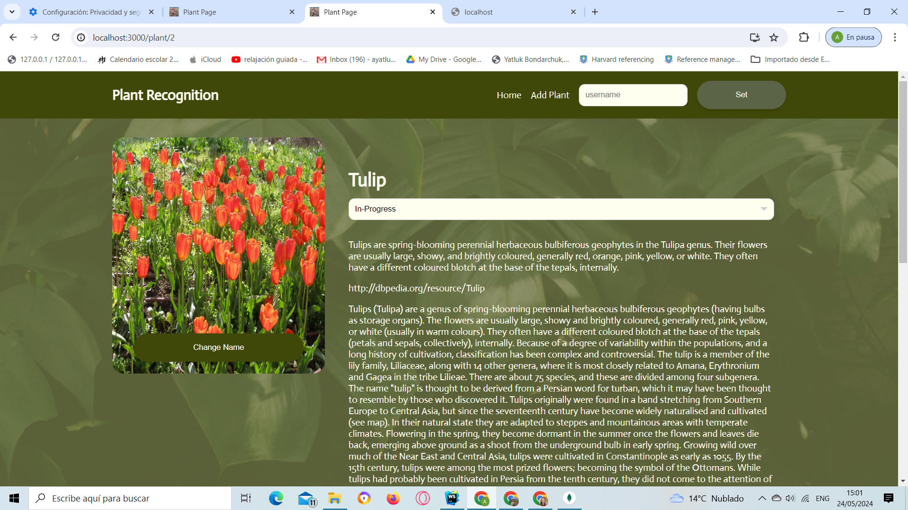
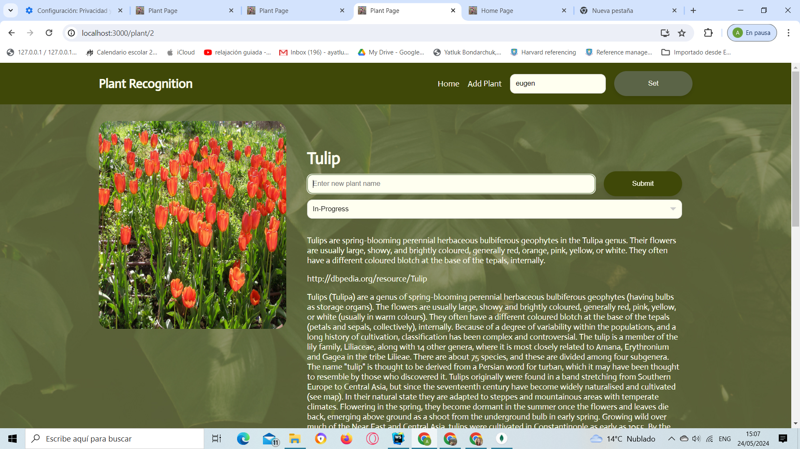
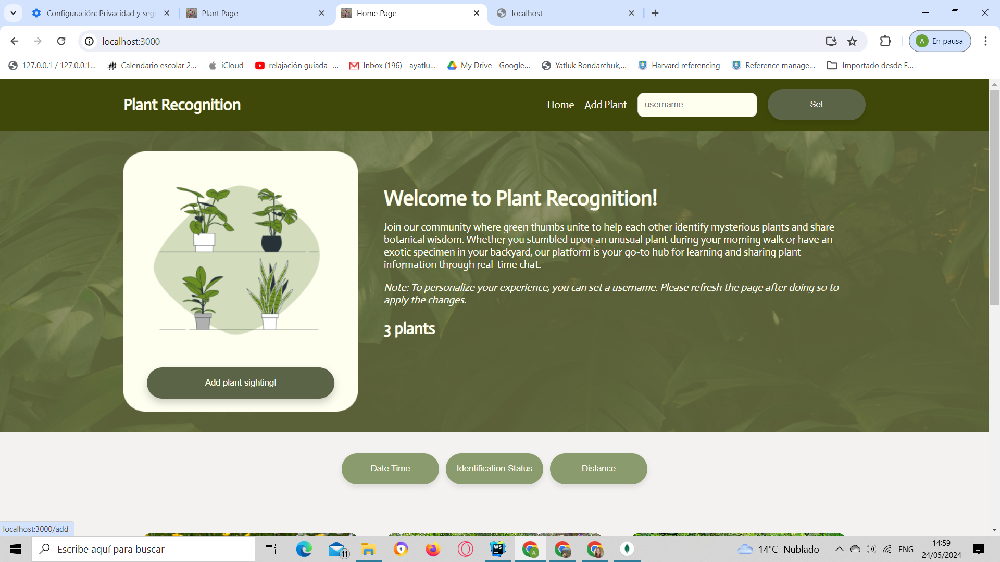
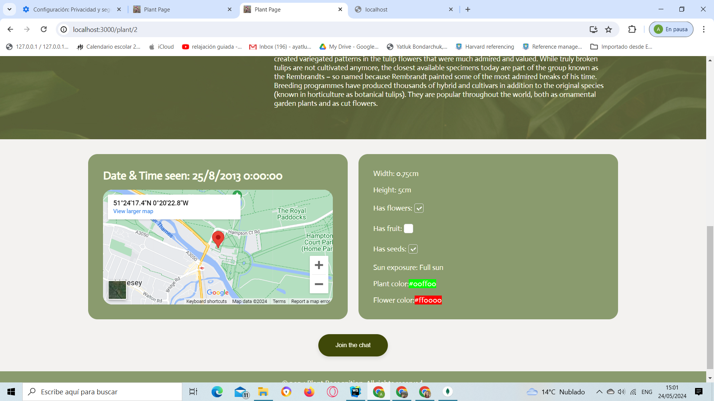
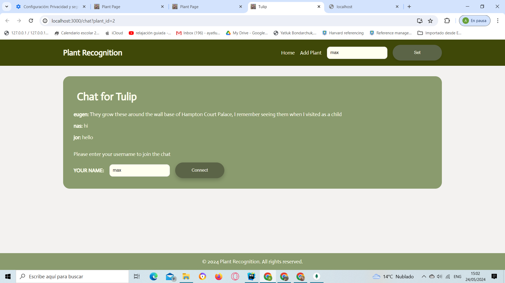
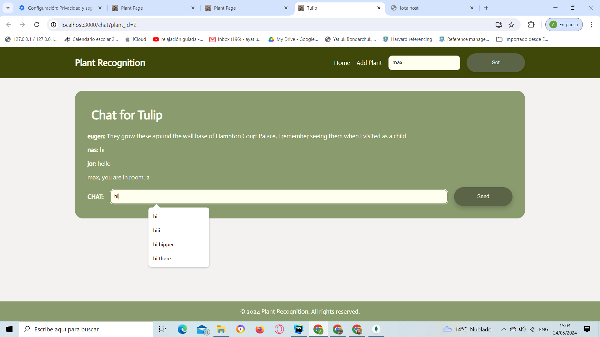

# COM3504 The Intelligent Web

## Setup

1. Navigate to the project directory.
2. Run `npm install` in the terminal to install the required libraries.
3. Make sure the MongoDB is running on port 27017.
4. Run `npm start` to start up the server.
5. Browse http://localhost:3000/

## Description

Plant Recognition is a progressive web application designed for plant enthusiasts and botanists alike. This application allows users to record new plant sightings, view plants added by themselves or others, and participate in community-driven plant identification. The app leverages client-server architecture and is built using Node.js with EJS templating.

## Features
* **Add New Plant Sightings:** Users can input comprehensive details about a plant including its location, size, and unique characteristics along with a photo.

* **View Plant Sightings:** Users can view a sorted list of plant sightings. The user can choose to sort the plants by date/time seen, identification status and distance.

* **Plant Identification:** Users can suggest names for unidentified plants. The community can contribute to the identification via chat which the original user can view and agree to change name of the plant.

* **Real-time Chat:** Each plant sighting has an associated real-time chat for discussion, making identification collaborative.

* **Offline Functionality:** The app supports offline data entry and synchronization for new plant entries and other views.

* **Integration with DBPedia:** Once the plant is added, the app fetches detailed information from DBPedia to enrich plant data.

# Adding a New Plant Sighting
1. Navigate to the Home page.
2. Click on Add Plant Sighting to start documenting a new find.
3. In the form, fill out the plant's name, description, and the user's name.
4. Upload an Image: Add a photo by clicking on the image placeholder and selecting a file from your device.
5. Enter the Location Information:
6. Specify the date and time of the sighting.
7. Use the geolocation button to automatically fetch your current coordinates or manually enter the latitude and longitude.
8. Detail the Plant Characteristics such as size, presence of flowers, fruits, seeds, leaf type etc.
9. Choose the plant's sun exposure and color attributes.
10. Click the Save button to submit the sighting.

### Scripts Included
* image_preview.mjs: Manages the dynamic preview of uploaded images.
* form_submission.mjs: Handles the secure submission of the plant sighting forms.

# Viewing and Sorting Plant Entries
Our application provides an intuitive interface for viewing detailed information about each plant and filtering through the plant entries based on specific criteria. Here’s how you can navigate and utilize these features:

## Viewing Plant Details
To view detailed information about a plant, follow these steps:

1. Navigate to the Home page: Start by visiting the home page where all plant entries are displayed.
2. Select a plant: Click on any plant to go to its detailed view.
3. Explore plant details: On the plant's detailed page, you'll see:
* Images of the plant.
* Comprehensive details including the plant's name, description, and a dynamic link to learn more.
* A summary of the plant's characteristics like width, height, flower presence, and coloration.
* An interactive map showing the location where the plant was spotted.
* The identification status, which you the user who added the plant can change to track the progress of plant identification.

## Changing Plant Name
To rename a plant directly from its profile:

1. Set the username to the one when you added the plant and reload the page.
2. Click the "Change Name" button: This button is visible under the plant image.
3. Enter the new name: Type the desired name in the input field that appears.
4. Submit the change: Click the "Submit" button to update the plant's name.

## Sorting Plant Entries
To filter plant entries based on specific criteria such as date, identification status, or distance:

1. Access the sorting section: At the home page, locate the sorting buttons above the plant entries.
2. View filtered results: The plant entries will update to only display those that meet the selected criteria.

## Interactive Features

1. Join the Chat: Each plant detail page includes a "Join the Chat" button, allowing users to discuss the plant in real-time with other enthusiasts.
2. Map Integration: Click on "View larger map" in the map section to explore the exact location of the plant sighting.

## Scripts Utilized
The following scripts enhance the functionality of the plant viewing and filtering process:
* /scripts/search.mjs: Manages the search and filtering operations.
* /scripts/list_plants.mjs: Handles the display of plant entries.
* /scripts/filter.mjs: Applies dynamic filters based on user selections.

# Chat Room
Our chat room allows community members to discuss plants and share insights in real-time. Here’s how to join and participate in the discussion:

## Joining the Chat
1. Open the Plant Detail Page: Navigate to any plant's detail page and scroll down to the "Chat for [Plant Name]" section.
2. Enter Your Username: If not already set, enter your preferred username in the text field provided.
3. Connect: Click the "Connect" button to join the chat room dedicated to the plant.

## Chat Interface
1. View Past Messages: Upon joining, previous messages in the chat for that specific plant are displayed.
2. Send a Message: Type your message in the text input box and click "Send" to post it in the chat.

## Automatic Username Recall
The chat interface automatically retrieves and fills in your last-used username, stored locally, to streamline the login process.

## Real-time Interaction
Engage with other users in real-time to discuss characteristics, care tips, and interesting facts about the plants.

## Contact

1. Team: Bsc18

2. Team members: 

   Alexander Dobson-Pleming            

   Eleanor Higgs          

   Anastasiia Yatluk Bondarchuk  

3. Github repo url: https://github.com/AlexDobsonPleming/COM3504